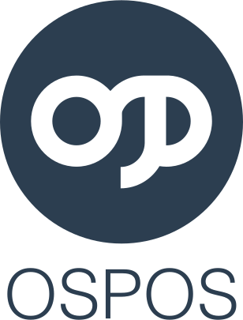
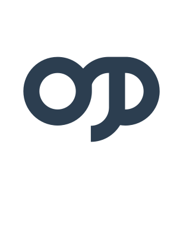

## Style Guide

Brand name: `Open Source Point of Sale`\
Short name: `OSPOS`

Font used for lettermark: `Helvetica Light`

### Brand Colors
|   |  |  |
|---|---|---|
| **Colors** | Primary | Secondary |
| Hexadecimal | # 2c3e50 | # ffffff |
| RGB decimal | R 44, G 62, B 80 | R 255, G 255, B 255 |

### Primary logo styles for use on light backgrounds

|   |  |  |  |  |
|---|---|---|---|---|
| **Logo style** | Logo | Emblem | Mark | Lettermark |

### Secondary logo styles or use on dark backgrounds

|   |  |  |  |  |
|---|---|---|---|---|
| **Logo style** | Logo | Emblem | Mark | Lettermark |
